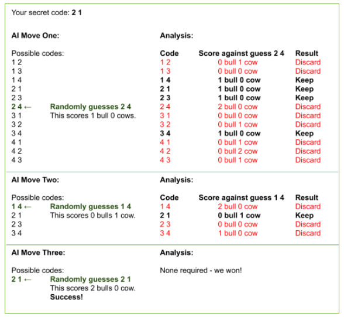

# Assignment Two: Bulls & Cows Part B

### *UML diagrams Due Date (Submit via GitHub Classroom): 18 May 23:59*

### *Code and Reflection Due Date (Submit via GitHub Classroom): 26 May 23:59*

## Overview
This assignment is divided into two parts, A and B. The assignment requires you to develop a simple game called Bulls & Cows. There are six compulsory tasks in this part of the assignment to complete.

Before starting the assignment, read through and gain an understanding of the requirements.

You may use any concepts taught in this course as well as any predefined classes from Java 21 to complete this assignment.

## Criteria
Your assignment will be marked based on the correctness of your program and your programming style. Here are some questions to consider for the programming style:

* Is the code well-structured?
* Is the code self-explanatory?
* Can you understand the code easily?
* Are all variables properly defined with meaningful and clear code?
* Is there any commented out code?

Marks will be deducted if your code has a bad programming style.

No marks will be awarded in the following situations:
* If the markers cannot compile your code.
* If you only have one class, excluding the provided classes, for this part of the assignment.
* If there is no use of inheritance for this part of the assignment.
* If you use any external libraries that require the import of jar files.

## Submission
After completing the assignment, you should have a functional Java program with some number of classes (depending on your own design), two UML class diagrams, and your reflection of the assignment. You submit by ensuring your GitHub repository for this assignment is up-to-date. We will download your repository for marking on the due date.

Late submissions are not permitted. You will get a mark of zero if your repository does not contain your submission when we download it.

## Assignment Details
This part of the assignment is a continuation from Part A. Please read the following instructions carefully, and then copy the source folder (src) of Part A to this project's source folder (src) and make sure everything is working as expected.

## Task One: Extending your design from Part A (1 mark)
In this part of the assignment, we would like you to extend the bulls and cows game to allow the player to play against the hardest level of the computer. We would also like to customise the game so that the player can guess six-digit codes.

Using either pen & paper or the diagramming tool of your choice, prepare a UML class diagram which shows all the classes and important methods of your Bulls & Cows implementation, along with the appropriate relationships showing how these classes fit together, from Part A.

Carefully read through all tasks in Part B, and prepare another UML class diagram which shows the updated design of your game. The diagram should be based on the extensions described in this part of the assignment as well as any improvements you made.

You will commit and push the two UML class diagrams (as a PNG or JPEG) to the top level of your repository (i.e. where the README.md is located). **You must submit the two diagrams before 18 May.** Failure to submit your diagrams before the due date will result in a mark of zero for Part B.

Note: It is OK if your final implementation doesn't match your design 100% for Part B. You will document this process in the later task.

## Task Two: Refactoring (0 marks)
A good practice in software development is to refactor your code whenever you find the opportunity to do so. Refactoring is about re-writing the code to improve the design, structure and algorithm while the functionality of the software as well as the expected behaviours and outcomes remain the same. You can consider the list of things to avoid based on Assignment 1 feedback.

Before extending your implementation from Part A, you may refactor your code so that you can implement the following tasks more easily. Whenever you refactor, you should make sure all the tasks from Part A still work as expected. Don't forget to document all the changes you have made in your reflection.

## Task Three: Hard AI (2 marks)
Modify your code so that the player can additionally choose to play against a hard AI opponent. When a hard AI is selected, the computer should be much more intelligent when guessing, rather than just choosing at random. To receive full marks, you must use the following strategy.

### Strategy for Hard AI
This strategy involves keeping a list of all possible guesses, and then intelligently pruning that list based on the result of each guess made by the AI. In this strategy, the first guess by the computer will be chosen randomly. After this guess, all subsequent guesses will be carefully planned. The computer keeps a track of precisely which codes remain consistent with all the information it has received so far. The computer will only choose a guess that has a chance of being the correct one.

For example, let’s assume the computer’s first guess scored 1 bull and 1 cow. Then the only codes that still have a chance to be the correct one, are those which match up 1 bull and 1 cow with the first guess. All other codes should be eliminated. The computer will go through its list of all possible codes and test each against its first guess. If a code matches 1 bull and 1 cow with the first guess, then it will remember that the code is still a possible candidate for the opponent's secret code. If a code does not match 1 bull and 1 cow with the first guess, the code will be eliminated. After this is completed, the computer randomly chooses any of the possible candidates for the second guess.

If the computer’s second guess scored 2 bulls and 1 cow, the computer checks all the remaining candidates to see which codes match up 2 bulls and 1 cow with the second guess. Those codes that do not match are eliminated. In this manner, each guess is consistent with all the information obtained up until that point in the game.

To illustrate the process, consider the scenario shown in the following figure, in which a simpler version of the game is being played. In this demonstration, secret codes are only two digits in length, and may only contain the characters 1 through 4. The player has chosen "2 1" as their secret code, which the AI is trying to guess. Using this process of elimination, the AI is able to quickly guess the player’s code.

## Task Four: Testing HexaComputer (1 mark)
In this task, you are required to write unit tests for the `HexaComputer` class provided in the repository. The class manages a list of hexadecimal codes, ensuring that only valid codes are stored. A valid code is where the code is exactly six unique characters. The allowed characters for the code are numbers, 0 - 9, and letters, a - f. The class also has a method that returns a code from its list based on the provided index.

Write and test the `HexaComputer` class in the provided `TestHexaComputer` class. When writing unit tests, you should ensure that the tests check for the requirements described above as well as cover as much of the code as possible. If you discover a bug based on your tests, you may fix the code in `HexaComputer` and document how you discovered the bug in Task Six.

## Task Five: Playing with Six-Digit Code (2 marks)
Modify your code so that when the player chooses to play the 'Single Player' mode, they can select either four-digit or six-digit code as the type of code to break. 

If the player chooses four-digit code, then the game should proceed in exactly the same manner as in Part A. If the player chooses six-digit code, the following will occur:

1. The game will import a simple file named **hexadecimals.txt**. This file contains a list of six-digit codes for the computer. This file is provided to you in the repository.
   - If the game cannot find the file, then you should prompt the player with an appropriate error message and return to the beginning of the game.  
   - Otherwise, the game will read the file and return a list of codes.
2. After the file is imported, you must use `HexaComputer` to retrieve a code. The code should be chosen at random to serve as the secret code for the player to guess.
3. The game should then proceed in a similar manner as in Part A. The game will verify that the player has entered a valid guess. The prompt for player input, results for each guess and the final outcome should be displayed appropriately on the console.
4. You do not need to ask the player to save the results to a file at the end of the game.

Note: It is important that, when modifying your code, the rest of your code should not break! Everything else should continue working as normal. You should also aim to reuse as many existing methods and classes from previous tasks as possible.

You may move the `HexaComputer` class to an appropriate package that fits your game structure. However, you should not modify anything else in the class.

## Task Six: Reflection (4 marks)
Now that you have completed the tasks, it's time to reflect upon your design and implementation.

In the [Reflection.md](Reflection.md) file, write two to four paragraphs reflecting on your learning as well as your design and implementation for this assignment. 

Your reflection must also explain the following:
* Which task(s) did you find the most challenging?
* Briefly describe the scenarios you have covered when testing the `HexaComputer` class.
* If there are any bugs in Task Four, briefly explain the bugs and how you have identified such bugs.
* What changes did you make from Part A to Part B?
* Comparing the initial design you created for Part A with your final implementation, how different are they? Why did you change your design?
* Which part(s) of your design (final class diagram) and/or implementation is good? 
  * What makes them good?
  * If you do not think your design / implementation is good, explain what and how you could improve.
  * Please also specify the class(es), method(s) and/or line number(s)
* If you used any external resources such as Generative AI tools, how well did you think the resources have supported you to complete this assignment? How different do you think your work might look like without any use of external resources? Also, list any external resources you have used.
* If you have time to extend this assignment, what would you do?