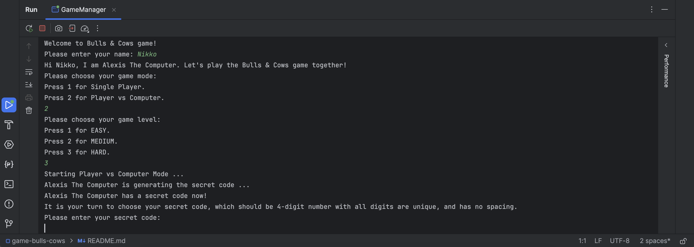
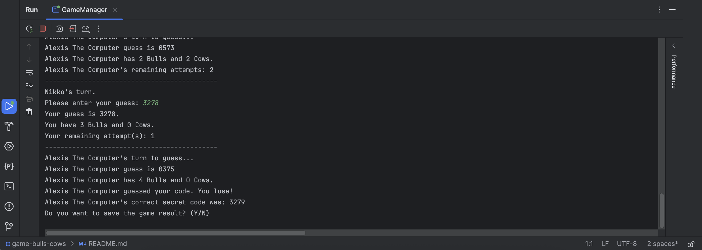
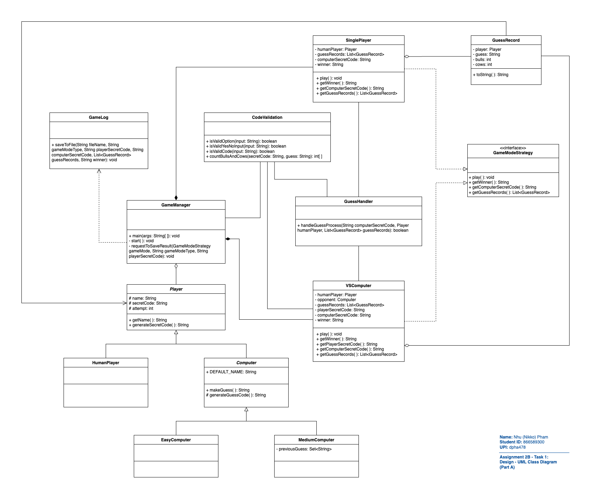
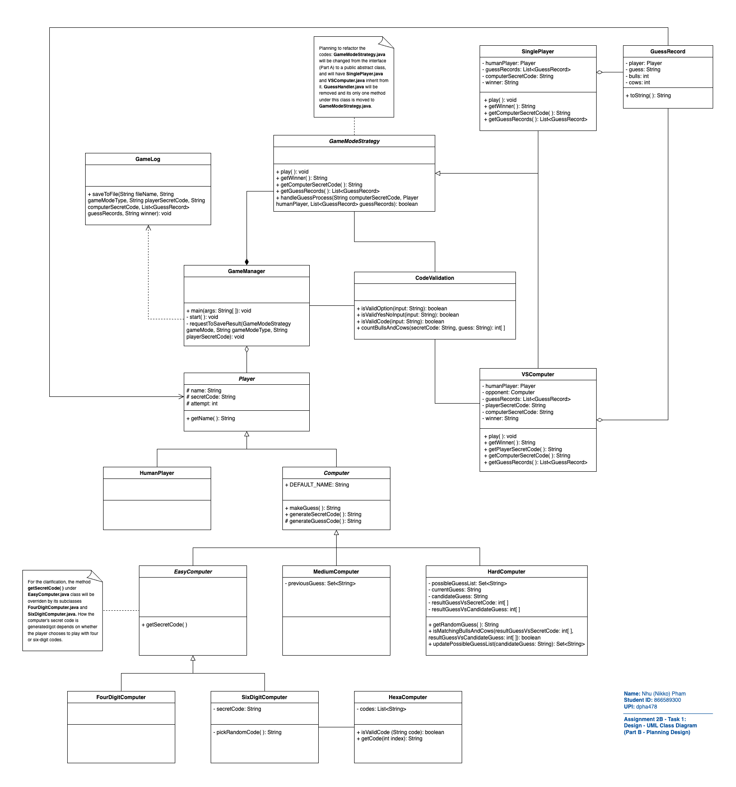
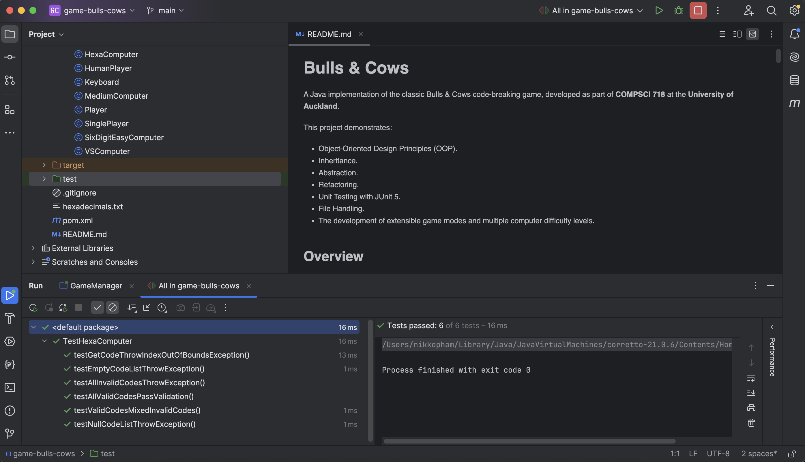

# Bulls & Cows

A Java implementation of the classic Bulls & Cows code-breaking game, developed as part of **COMPSCI 718** at the **University of Auckland**.

This project demonstrates:

- Object-Oriented Design Principles (OOP).
- Inheritance.
- Abstraction.
- Refactoring.
- Unit Testing with JUnit 5.
- File Handling.
- The development of extensible game modes and multiple computer difficulty levels.



## Overview

Bulls & Cows is a code-breaking game where players attempt to guess a secret code within a limited number of attempts.

The game supports both Single Player and Player vs Computer modes. Single Player mode supports both four-digit numeric codes and six-digit hexadecimal codes, while Player vs Computer mode supports four-digit numeric codes with Easy, Medium, and Hard computer difficulty levels.

Additional features include game result logging, file-based secret code generation for hexadecimal mode, and automated unit testing for code validation components.

Throughout the project, significant refactoring was performed to improve maintainability, reusability, and extensibility while preserving existing functionality.

## Prerequisites

- Java 21+
- Maven 3.9+
- JUnit 5
- IntelliJ IDEA / Visual Studio Code

## Getting Started

### 1. Clone the Repository:

```bash
git clone https://github.com/nikko9196/game-bulls-cows.git
cd game-bulls-cows
```

### 2. Running the Game:

#### IntelliJ IDEA:

1. Right-click on `GameManager.java` in `src/bullsandcows/GameManager.java`, select `Run 'GameManager.main()'`.
2. The game will start in the console.

#### Visual Studio Code:

1. Open the project folder in VS Code.
2. Ensure the Java Extension Pack is installed.
3. Right-click on `GameManager.java` in `src/bullsandcows/GameManager.java`, select `Run Java`.
4. The game will start in the integrated terminal.

## Project Structure

```text
game-bulls-cows/
|-- docs/
|   |-- diagrams/                         # UML class diagrams.
|   |-- screenshots/                      # Project screenshots.
|-- src/
|   |   |-- bullsandcows/                 # Main application source code.
|   |         |-- GameManager.java        # Application entry point.
|   |         |-- ...                     # Additional classes supporting game logic and functionality.
|-- test/
|   |   |-- bullsandcows/
|   |         |-- TestHexaComputer.java   # JUnit 5 unit tests for HexaComputer validation and retrieval logic.
|-- hexadecimals.txt                      # Source file containing hexadecimal codes for six-digit game mode.
|-- pom.xml                               # Maven project configuration and dependency management.
|-- README.md
```

## Game Features

### Single Player Mode:

Players attempt to guess a secret code generated by the computer.

Available code formats:

- Four-digit numeric codes with unique digits
- Six-digit hexadecimal codes with unique characters (0-9, a-f)

The six-digit mode loads secret codes from an external file and includes validation and error handling for invalid or missing data:

- The six-digit mode loads secret codes from `hexadecimals.txt`.
- This mode includes:
  - File-based code loading.
  - Hexadecimal code validation.
  - Random secret code selection.
  - Error handling for missing files.

### Player VS Computer Mode:

Players compete directly against a computer opponent.
The player creates a secret code while simultaneously attempting to break the computer's code.
The starting player is selected randomly at the beginning of each match.

#### Multiple Computer Difficulty Levels:

- **Easy:** Generates random guesses.
- **Medium:** Generates random guesses while avoiding previously attempted guesses.
- **Hard:** Uses a candidate elimination approach to progressively narrow down possible solutions based on previous Bulls and Cows results:
  1. Maintains a list of all possible candidate codes.
  2. Makes a guess.
  3. Evaluates the Bulls and Cows result.
  4. Eliminates candidates that are inconsistent with previous results.
  5. Selects future guesses only from the remaining valid candidates.
     This significantly improves guessing efficiency compared with random guessing.

### Input Validation:

The game validates:

- Menu selections.
- Yes/No responses.
- Four-digit codes.
- Six-digit hexadecimal codes.

Invalid inputs are rejected with user-friendly feedback.

### Game Result Logging:

Players can optionally save game results to a text file after completing a match.
Saved information includes:

- Game mode
- Secret codes
- Guess history
- Bulls and Cows results
- Winner



## UML Design Evolution

### Initial Design:

The original UML design focused on:

- Single Player mode
- Player VS Computer mode
- Both with 4-digit secret codes.
- Difficulty level: Easy and Medium.



### Extended Design:

The final design introduced:

- Additional difficulty level: Hard.
- New 6-digit secret codes.
- `HexaComputer` integration.
- Improved inheritance hierarchy.
- Refactored `GameModeStrategy` architecture.



## Running Unit Tests

#### IntelliJ IDEA:

Right-click on `TestHexaComputer.java` in `test/bullsandcows/TestHexaComputer.java`, select `Run 'TestHexaComputer'`.

#### Visual Studio Code:

Right-click on `TestHexaComputer.java` in `test/bullsandcows/TestHexaComputer.java`, select `Run Tests`.

Alternatively, use Maven:

1. Open the integrated terminal.
2. Run

```bash
mvn test
```


